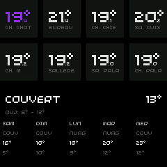
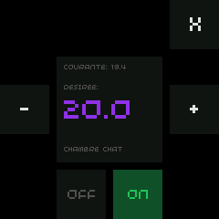

# Thermostat Controller for Pimoroni Presto

A touch-screen thermostat dashboard running on the [Pimoroni Presto](https://shop.pimoroni.com/products/presto), a compact 4-inch display powered by the RP2350. It connects to [Home Assistant](https://www.home-assistant.io/) over WebSocket and lets you monitor and control all your climate entities from a single panel.


---

## Screenshots

| Home                               | Focused room                                  |
| ---------------------------------- | --------------------------------------------- |
|  |  |

## Features

- **Multi-room overview** — grid of tiles showing current and target temperatures for every climate entity in Home Assistant, updated every 15 seconds
- **Room control** — tap any tile to focus it: adjust the target temperature in 0.1 °C steps and toggle heating mode
- **Weather forecast** — 5-day forecast pulled from a Home Assistant weather entity, shown alongside the room tiles
- **Outdoor sensor** — optionally display a read-only temperature from any HA entity (e.g. an external sensor)
- **Responsive layout** — tiles reflow based on the number of rooms; the grid adapts automatically
- **Efficient rendering** — partial screen updates via `presto.partial_update()` keep the display smooth without full redraws
- **Custom WebSocket client** — RFC 6455 implementation in MicroPython, no external library required

## Hardware

- [Pimoroni Presto](https://shop.pimoroni.com/products/presto) — the only required piece of hardware
- Flashed with the [Pimoroni MicroPython build](https://github.com/pimoroni/presto) for Presto

## Setup

### Prerequisites

- [mise](https://mise.jdx.dev/) (tool version manager)
- A running Home Assistant instance with a long-lived access token
- Your Presto connected via USB

### Install

```bash
make install
```

This installs `mise` if needed, then installs Python dependencies (via `pdm`).

### Configure

Copy `secrets.py.example` to `secrets.py` and fill in your Home Assistant details:

```python
# secrets.py
WIFI_SSID = "your-wifi"
WIFI_PASSWORD = "your-password"
HA_URL = "homeassistant.local"
HA_TOKEN = "your-long-lived-access-token"
```

Then adjust `config.py` to match your setup:

```python
HA_WEATHER_ENTITY = "weather.your_location" # for the forecast section
HA_OUTDOOR_ENTITY = None                    # optional outdoor sensor entity_id
HA_SYNC_INTERVAL_MS = 15000                 # thermostat sync interval
HA_WEATHER_SYNC_INTERVAL_MS = 300000        # weather sync interval
```

### Deploy

```bash
make run    # copy files to the device and reset
make dev    # copy files and run immediately (without hard reset)
```

Other useful targets:

```bash
make repl        # open a MicroPython REPL on the device
make reset       # hard reset the device
make bootloader  # enter bootloader mode (for firmware flashing)
make style       # run linter and formatter
```

## Project structure

```
├── main.py           # entry point, async task orchestration
├── config.py         # tuneable parameters
├── secrets.py        # WiFi and Home Assistant credentials (git-ignored)
└── src/
    ├── core.py       # Presto initialization and event loop
    ├── views.py      # all views and tile components
    ├── components.py # base component classes
    ├── colors.py     # color palette
    ├── models.py     # Room and Weather data models
    ├── ha_service.py # Home Assistant service layer
    ├── ha_client.py  # WebSocket client (RFC 6455)
    ├── logger.py     # logging utility
    └── buzzer.py     # audio feedback
```

## Inspired by

[compresto](https://git.hack-hro.de/kmohrf/compresto) — a Presto UI framework that sparked the idea for this project.

## License

MIT
